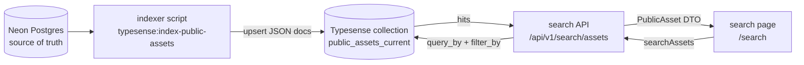

# Typesense Cloudflare Access Runbook

This runbook documents the public search infrastructure for Fotocorp:

```text
Browser
  -> apps/web BFF: /api/public/search/assets
  -> apps/api Worker: /api/v1/search/assets
  -> Cloudflare Access + Tunnel: https://search.fotocorp.com
  -> VPS-local Typesense: http://127.0.0.1:8108
```

The browser must never call Typesense directly and must never receive the Typesense host, Typesense API key, Cloudflare Access client ID, or Cloudflare Access client secret.

## Why Typesense Exists

Fotocorp moved public catalog search toward Typesense because the existing Postgres-backed `/search` flow was too slow for the public asset catalog. The slow path came from:

- aggregate-heavy filters and facets
- derivative readiness joins
- event and category joins
- query-time text search over public metadata
- group-by work for public filter counts

Typesense is now the dedicated rebuildable public search and facet index. Neon/Postgres remains the source of truth.

## Three-Layer Architecture

Typesense search is a projection pipeline with three distinct layers. Do not mix them when debugging.



| Layer | Role | Source file |
| --- | --- | --- |
| **1. Indexing** | Reads Postgres, writes Typesense documents | [`apps/api/scripts/search/index-public-assets-typesense.ts`](../../apps/api/scripts/search/index-public-assets-typesense.ts) |
| **2. Search query** | Builds Typesense URL (`query_by`, `filter_by`, `facet_by`) | [`apps/api/src/lib/search/typesense-public-assets.ts`](../../apps/api/src/lib/search/typesense-public-assets.ts) |
| **3. Response mapping** | Typesense hit → frontend `PublicAsset` shape | same file, `mapPublicAssetDocument()` |

Typesense does **not** read Postgres at search time. It only sees what the indexer wrote.

### Search UX contract

- **Search bar submit** (Enter / Search button with non-empty text): global archive query. Clears event, category, city, and date scope filters.
- **Sidebar / chip filters**: scoped browse (event page deep links, category tabs, date range). Preserved until the user clears them or submits a new text query.
- **Browser URL params**: use stable `eventId` / `categoryId` for UUID deep links. The API accepts both `eventId`/`event` and `categoryId`/`category`; UUID values always map to `event_id` / `category_id` filters regardless of param name.

## Field Inventory Reference

Use this table when deciding what to add, remove, or reindex to save RAM. **Trust the live collection schema** (`GET /collections/public_assets_current`) over indexer source code alone — collections do not auto-migrate when the indexer schema changes.

### Eligibility gate (indexing only)

An asset is indexed only when all of the following are true:

- `image_assets.status = 'ACTIVE'`
- `image_assets.visibility = 'PUBLIC'`
- `image_assets.media_type = 'IMAGE'`
- `image_assets.original_exists_in_storage = true`
- required protected `CARD` derivative: `generation_status = 'READY'`, `is_watermarked = true`, `watermark_profile = fotocorp_card_light_preview_v1`

Optional `THUMB` and `DETAIL` derivatives are included when they match current public profile rules.

### Field mapping table

| Typesense field | Postgres source | Searchable (`query_by`) | Filterable | Facet | Stored in hits | Notes |
| --- | --- | --- | --- | --- | --- | --- |
| `id` | `image_assets.id` | no | no | no | yes | document primary key |
| `asset_id` | `image_assets.id` | no | no | yes | yes | duplicate id for facet compat |
| `fotokey` | `image_assets.fotokey` | **yes** | no | no | yes | direct Fotokey lookup |
| `event_title` | `photo_events.name` | **yes** | yes | yes | yes | canonical title-like search field |
| `caption` | `image_assets.caption` | **yes** | no | no | yes | editorial caption text |
| `who_is_in_picture` | `image_assets.who_is_in_picture` | **yes** | no | no | yes | full editorial name string; not parsed away |
| `people` | parsed from `who_is_in_picture` | **yes** | yes | yes | yes | comma/semicolon tokenized names |
| `keywords` | `image_assets.keywords` | **yes** | yes | yes | yes | normalized string array |
| `category_name` | `coalesce(asset.category, event.category)` | **yes** | yes | yes | yes | human-readable category |
| `event_id` | `photo_events.id` | no | **yes** | yes | yes | UUID event filter |
| `category_id` | `coalesce(asset.category_id, event.category_id)` | no | **yes** | yes | yes | UUID category filter |
| `event_location` | `photo_events.location` | no | **yes** | live: no | yes | city filter uses this field on live alias |
| `city` | `photo_events.location` (duplicate) | no | yes | target v2: yes | maybe | indexer emits; live alias may lack this field |
| `event_date_ts` | `photo_events.event_date` | no | no | no | yes | Unix seconds; sort only |
| `image_date_ts` | `image_assets.image_date` | no | **yes** | yes | yes | year/month filter range |
| `created_at_ts` | `image_assets.created_at` | no | no | no | yes | default sort field |
| `updated_at_ts` | `image_assets.updated_at` | no | no | no | yes | sort optional |
| `published_at_ts` | — | no | no | no | optional | reserved for future ranking |
| `rank_score` | — | no | no | no | optional | reserved for future ranking |
| `status` | `image_assets.status` | no | **yes** | yes | yes | always filtered `ACTIVE` |
| `visibility` | `image_assets.visibility` | no | **yes** | yes | yes | always filtered `PUBLIC` |
| `source` | `image_assets.source` | no | no | yes | yes | facet counts in search sidebar |
| `media_type` | `image_assets.media_type` | no | yes | yes | yes | indexed as `IMAGE` only |
| `contributor_id` | `contributors.id` | no | yes | yes | yes | filter/display |
| `contributor_display_name` | `contributors.display_name` | no | no | no | yes | display only |
| `event_keywords` | `image_assets.event_keywords` | no | no | no | yes | stored; not in `query_by` |
| `search_text` | `image_assets.search_text` | **no** | no | no | dropped | Postgres FTS blob; emitted by indexer but not in live schema |
| `description` | `image_assets.description` | **no** | no | no | dropped | emitted by indexer but not in live schema |
| `headline` | `image_assets.headline` | **no** | no | no | maybe | compat/display only |
| `title` | computed fallback | **no** | no | no | maybe | compat/display only; not in `query_by` |
| `preview_thumb_url` | derivative + CDN | no | no | no | maybe | card rendering in search results |
| `preview_card_url` | derivative + CDN | no | no | no | maybe | primary grid thumbnail |
| `preview_detail_url` | derivative + CDN | no | no | no | maybe | detail variant when present |
| `preview_*_width/height` | derivative dimensions | no | no | no | maybe | layout/aspect ratio |
| `preview_*_storage_key` | `image_derivatives.storage_key` | no | no | no | maybe | internal; not exposed to browser |

### What is searched (`query_by`)

```text
event_title,caption,who_is_in_picture,people,keywords,category_name,fotokey
```

**Not searched** even if present in Postgres or emitted by the indexer:

- `search_text` — Postgres FTS aggregate; would duplicate/conflict with field-level search if added without review
- `description`, `headline`, `title` — display/compat; `event_title` is the canonical title field
- `event_keywords` — stored for future use, not in current contract

### Request param → filter mapping

| URL param | UUID value | Text/name value |
| --- | --- | --- |
| `eventId` or `event` | `event_id:=...` | `event_title:=...` |
| `categoryId` or `category` | `category_id:=...` | `category_name:=...` |
| `city` | — | `event_location:=...` |
| `person` | — | `people:=...` |
| `keyword` | — | `keywords:=...` |
| `year` / `month` | — | `image_date_ts` Unix range |

All searches always include: `status:=ACTIVE && visibility:=PUBLIC`

Current `facet_by`: `category_name,event_title,source`

### Schema drift warning

The indexer script defines the **target** v2 schema (includes `city` facet). If the collection was created before a schema change, Typesense does not auto-migrate. Verify live fields:

```bash
curl "https://search.fotocorp.com/collections/public_assets_current" \
  -H "CF-Access-Client-Id: ..." \
  -H "CF-Access-Client-Secret: ..." \
  -H "X-TYPESENSE-API-KEY: ..."
```

When drift exists, create a new collection, reindex, validate, then swap the `public_assets_current` alias.

### Future RAM optimization candidates

Fields to consider dropping from indexed documents after review:

- `search_text`, `description` — not searched; dropped on import when absent from schema
- duplicate `city` when `event_location` is sufficient
- `title`, `headline` — if frontend never reads them from Typesense hits
- `preview_*_storage_key` — if CDN URLs alone are enough for public search
- `asset_id` facet duplicate of `id`

Reindex required after any schema or document shape change.

## Services

### Typesense

Purpose:

- fast full-text search for public image metadata
- fast public facets and counts
- fast page-based search responses for the future frontend cutover

Current deployment:

- VPS-local service: `http://127.0.0.1:8108`
- Public raw port: not exposed
- Current collection alias: `public_assets_current`
- Current v2 collection: `public_assets_20260519_v2`

Current search contract:

```text
query_by=event_title,caption,who_is_in_picture,people,keywords,category_name,fotokey
```

Schema decisions:

- `who_is_in_picture` is indexed because users search named subjects directly, and parsing into `people` can lose context.
- `title` is not indexed because it duplicates the purpose of `event_title`.
- `event_title` is the canonical title-like search field.
- `title` and `headline` may remain stored compatibility fields if already present, but they are not search fields.

### Cloudflare Tunnel

Purpose:

- expose the VPS-local Typesense service to the Cloudflare Worker without opening port `8108` publicly
- keep Typesense bound to localhost on the VPS
- provide a stable HTTPS hostname for the API Worker

Hostname:

```text
https://search.fotocorp.com
```

Local service:

```text
http://127.0.0.1:8108
```

This tunnel is locally managed. If the Cloudflare dashboard says "This tunnel is locally managed", do not try to edit routes from the dashboard. Edit the VPS config file:

```text
/etc/cloudflared/config.yml
```

Current intended config:

```yaml
tunnel: fotocorp-typesense
credentials-file: /root/.cloudflared/64fb499e-cb4c-4846-a7d2-95d9b8f397d4.json

ingress:
  - hostname: search.fotocorp.com
    service: http://127.0.0.1:8108
  - service: http_status:404
```

### Cloudflare Access

Purpose:

- block public access to `search.fotocorp.com`
- allow only service-authenticated API calls to reach Typesense through the Tunnel

Access policy:

- Policy type: Service Auth
- Include rule: Service Token

Requests from the API Worker must include:

- `CF-Access-Client-Id`
- `CF-Access-Client-Secret`
- `X-TYPESENSE-API-KEY`

Use the full Cloudflare Access client ID and client secret values as header values only. Do not include the header-name prefix inside the value. Do not add extra quotes or spaces.

## API Integration

Existing API route:

```text
GET /api/v1/search/assets
```

Existing web BFF proxy:

```text
/api/public/search/assets
```

API env vars:

```env
TYPESENSE_HOST=https://search.fotocorp.com
TYPESENSE_API_KEY=...
TYPESENSE_COLLECTION_ALIAS=public_assets_current
TYPESENSE_SEARCH_TIMEOUT_MS=1500
TYPESENSE_CF_ACCESS_CLIENT_ID=...
TYPESENSE_CF_ACCESS_CLIENT_SECRET=...
```

Behavior:

- `X-TYPESENSE-API-KEY` is always sent server-side by the API Worker.
- `CF-Access-Client-Id` and `CF-Access-Client-Secret` are sent only when both Access env vars are configured.
- If only one Cloudflare Access env var is configured, search fails safely through the existing `typesense_not_configured` path.
- Browser code must never receive any Typesense or Cloudflare Access credential.
- Public frontend calls should go through `/api/public/search/assets`, not Typesense directly.

## Verification

### Local Typesense Health

Run on the VPS or through an SSH session on the VPS:

```bash
curl "http://127.0.0.1:8108/health"
```

Expected:

```json
{"ok":true}
```

### Local Typesense Smoke

Run from the repo with local env configured:

```bash
TYPESENSE_HOST=http://127.0.0.1:8108 pnpm --dir apps/api search:smoke-typesense
```

### Production Tunnel Health

Run from a machine that can reach Cloudflare:

```bash
curl "https://search.fotocorp.com/health" \
  -H "CF-Access-Client-Id: YOUR_ACTUAL_CLIENT_ID" \
  -H "CF-Access-Client-Secret: YOUR_ACTUAL_CLIENT_SECRET" \
  -H "X-TYPESENSE-API-KEY: YOUR_ACTUAL_TYPESENSE_API_KEY"
```

Expected:

```json
{"ok":true}
```

### Production Search Smoke

After Tunnel and Access are configured:

```bash
TYPESENSE_HOST=https://search.fotocorp.com \
TYPESENSE_CF_ACCESS_CLIENT_ID=YOUR_ACTUAL_CLIENT_ID \
TYPESENSE_CF_ACCESS_CLIENT_SECRET=YOUR_ACTUAL_CLIENT_SECRET \
pnpm --dir apps/api search:smoke-typesense
```

### Deployed API Validation

After Worker env vars are configured and deployed:

```bash
curl -s "https://YOUR_API_WORKER_HOST/api/v1/search/assets?q=*&limit=10&page=1" \
  | jq '{totalCount, count: (.items | length), facets, meta}'
```

## Operational Lessons

- If the dashboard says "This tunnel is locally managed", do not try to edit routes from the dashboard. Edit `/etc/cloudflared/config.yml`.
- If Cloudflare Access policy says `include field should not be empty`, the Service Token include dropdown was not selected properly.
- If `search.fotocorp.com` returns Cloudflare error 1033, the tunnel is not connected or the `cloudflared` service is failing.
- If `systemctl status cloudflared` shows a restart loop, inspect:

```bash
sudo journalctl -xeu cloudflared.service --no-pager
```

- If `/health` returns `{"ok":true}` through `https://search.fotocorp.com` with all three headers, the secure production path works.

## Security

- Rotate the Cloudflare Access service token and Typesense API key if they are pasted into logs, chats, screenshots, shell history, or docs.
- Store secrets only in Cloudflare Worker secrets, VPS env files, or secure local env files.
- Never expose Typesense credentials to browser code.
- Keep Typesense bound to localhost on the VPS.
- Do not open the raw Typesense port publicly.

## Cutover Sequence

The correct sequence remains:

1. Full index all public assets.
2. Verify alias has the full count.
3. Add secure Cloudflare Access headers.
4. Expose Typesense via Cloudflare Tunnel.
5. Validate deployed API `/api/v1/search/assets`.
6. Then switch frontend `/search` to `/api/public/search/assets`.
